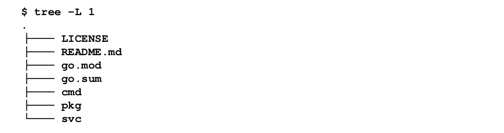

# Go kit explained

### Directory structure


| Package   |   Description |
| --------- |---------------|
| cmd       | contain various tools and commands support to development and operation, such as: <br> - test, graph dependency <br> - scripts for build, test, deploy |
| pkg       | implementation of micro-services, client libraries, abstract object model, support packages, unit test | 
| svc       | is where micro-services live, each micro-service is a separate binary with its main package

### Configuration
* #### Config with ConfigMaps
```yaml
apiVersion: v1
kind: ConfigMap
metadata:
    name: link-service-config
    namespace: default
data:
    MAX_LINKS_PER_USER: "10"
    PORT: "8080"
```
* #### Deployment files with envFrom
```yaml
apiVersion: apps/v1
kind: Deployment
    metadata:
    name: link-manager
    labels:
        svc: link
        app: manager
spec:
    replicas: 1
    selector:
        matchLabels:
            svc: link
            app: manager
    template:
        metadata:
        labels:
            svc: link
            app: manager
        spec:
            containers:
            - name: link-manager
            image: g1g1/delinkcious-link:0.2
            ports:
            - containerPort: 8080
            envFrom:
            - configMapRef:
                name: link-manager-config
```
* ### Create ConfigMaps
```text
$ kubectl create configmap test --dry-run --from-literal=a=1 --from-literal=b=2 -o yaml

$ kubectl create configmap file-config --dry-run --from-file comics.yaml -o yaml
```