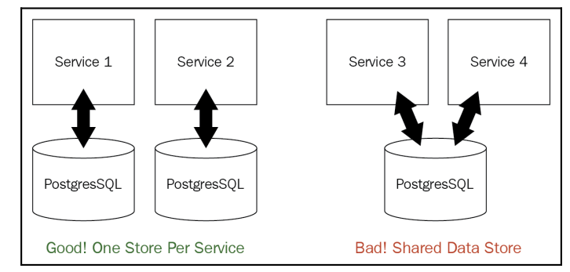
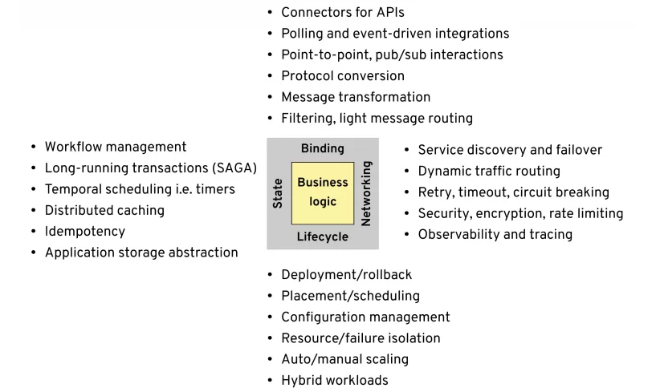

# Micro-services in go

### Micro-service-based architecture with 3 main options:
* #### Vertical approach
    - separate functionality of the system into multiple services
    - each team take a fully service, from design to implementation -> deploy and maintain 
    - suit for large organization
* #### Horizontal
    - look the system as a layered architecture. The team structure is organized alone those layered
    - have front-end group, back-end group and dev-ops group, each team is responsible for their own layer 
    - suit for smaller organization with small number of products 
* #### Matrix
    - vertical silos, have cross-cutting groups works with all vertical solos with consistency, uniformity, order

* ### Libraries
    - https://github.com/go-kit/kit
    - https://github.com/go-kit/kit/tree/master/cmd/kitgen
### Problem
* #### Troubleshooting across multiple services
    - expose API or other communication protocol such as gRPC 
* #### Something in real-world system
    - Configuration
    - Secret management
    - Service discovery
    - Central logging
    - Metrics
    - Authentication, Authorization, Security
    - Distributed tracing
* #### One data store per micro-service

* #### Overview about go-kit
    - Go-kit is all about best practises
    - Your business logic only is implemented as pure Go libraries, only deal with interface and struct 
    - Go-kit service as onion architecture with different layers 
    
    - Go-kit primarily supports RPC-style communication by using request-response model

Layer | Description |
--- | --- |
Transport   | interact with other services over network, such as HTTP, gRPC, Thrift, net/rpc |
Endpoint    | each endpoint respond with a function in service interface 
Service     | this is where your code plugs into system 
Middleware  |is implemented by decorator pattern to wrap service and endpoints with cross-cutting concerns, such as: 
           -| Resiliency (tries with exponential backoff)
           -| Authentication and authorization
           -| Logging, metrics collection, distributed tracing
           -| Service discovery
- Good distributied applications usually follow the 12-factor app and micro-services principles 
    - Stateless, scalable, configurable 
    - independently released, containerized, automatable
    - event-driven, serverless 
- Grouping the needs of modern distributed applications into 4 catogories:
    - lifecycle: is foundation, such as: programming language with available libraries in the ecosystem, the packaging format, and the runtime
        - Java use .jar format
        - All the maven dependencies as an ecosystem 
        - JVM as runtime
        - To release faster -> lifecyle for deploy, recovery from errors, scale services in an automated way 
        - micro-services: health-check, recovery, deployment, scaling 
        - Such as: Envoy, linkerd, consul, knative
    - Networking: distributed systems need master networking, such as: service discovery and error recovery, distributed tracing, message exchange patterns, point-to-point and pub/sub methods and smart routing mechanisms
        - Service discovery, managing security, metrics, tracing, recovery, recovery from errors, simulating errors
        - Service meshes can do advanced routing, help to test, security 
    - State: prefered stateless. In stateful apps needs reliable service orchestration and workflows, distributed singleton, temporal schedule (crontabs), idempotency, stateful error recovery, caching 
    - Binding: the components of distributed system talks to each other, integrate with modern and lagency external systems. Using connectors that can convert various protocols, support multiple message exchange patterns such as: polling, even-driven, request/ reply, transforms message formats, custom error recovery procedures and security mechanism  
    
    - Future architecture trends
### Problems
* #### [go-kit explained](gokitExplained.md)