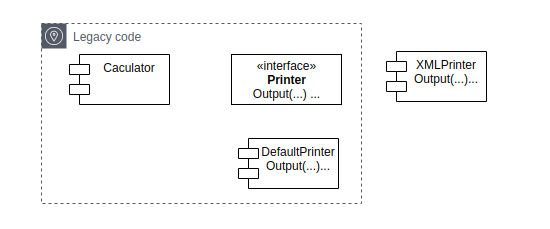
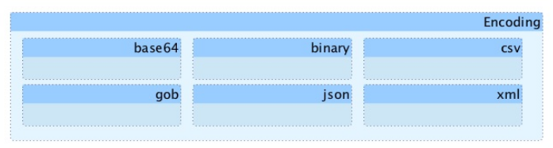
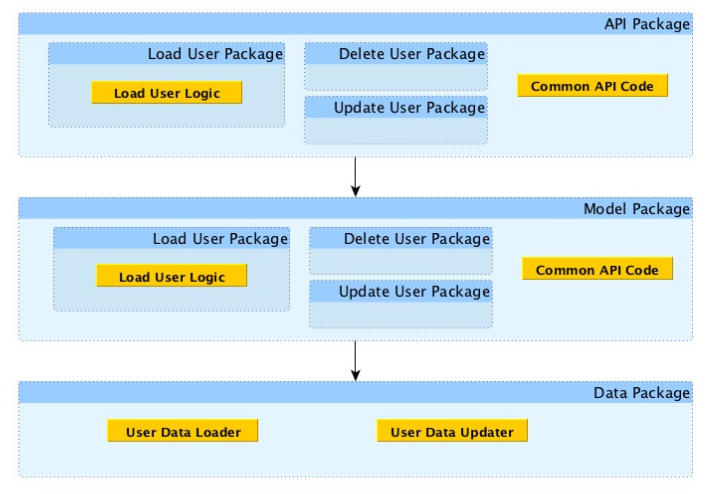
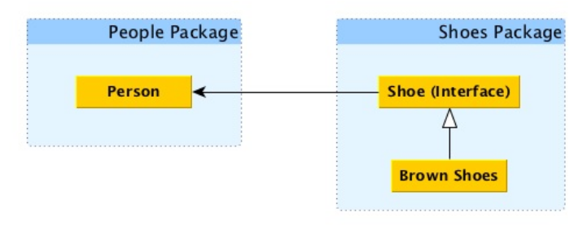
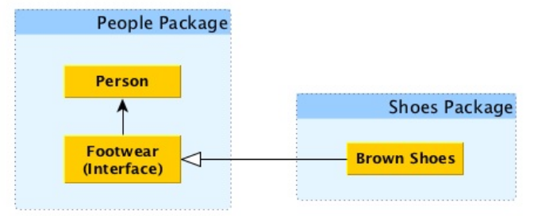

## SOLID principle

### Single Responsibility Principle
* #### Object is simple, easy to use, wide range of use, easy to test
* #### reduce complexity by decomposing code into smaller, more concise pieces

* #### increase the potential reusable code
* #### makes tests simpler to write and maintain
* #### SRP at function level
    - ##### reduce function's bloat
    - ##### increase its readability
* #### SRP at package level
    - ##### harder to do, good package is small, concise, and clean of purpose
    
    - => each different type is organized in its own package
    
### find the right abstraction, helps us identity when and where use DI    
### Open-Close Principle
* #### Entities (classes, modules, functions, ..) should open for extension and close for modification
    - open for add new package, new interfaces, or new implementation for an existing interface
    - closed for change legacy code or minimizing change
* #### Benefit:
    - reduce risk for additions or extensions
    - reduce number of changes needed to add or remove a feature
    - narrows the locality of bugs to only the new code and its usage
    ```text
    func convertV1() {}
    func convertV2() {}
    ``` 
* #### discover cleaner and more durable abstractions
### Liskov substitution Principle
* #### Subtypes must be substitutable for their base types
    ```text
    sled, _ := vehicle.(*Sled)
    concrete := vehicle.(type)
    ``` 
* #### LSP refers to behavior and not implementation
* #### Benefit : code consistently
* #### Use case violate LSP, can lead us to violate OCP, because code have too much knowledge of the implementation

### Interface Segregation Principle
* #### Interface should reduced to the minimum possible size (thin interface)
* #### leads to explicit inputs 
* #### interface as inputs to methods, interface need fat -> can violate SRP
```text
func encrypt(ctx context.Context, data []byte) ([]byte, err) {...}
-> violate ISP because ctx parameters too fat
```  
* #### helps decouple the inputs from their concrete implementation, enabling them to evolve separately
* #### Benefit: separate logical into particular features -> is interface roles -> is used in DI  

### Dependency Inversion Principle
* #### High-level module should not depend on low-level module, both should depend on abstraction
* #### Abstractions should not depend on implementation, implementation should depend on abstractions
* #### Dependency inversion focuses on the ownership of the dependencies's abstract definition
* #### Dependency injection focuses on using those abstractions

* #### Everything should rely on clean abstractions, satisfying both LSP and ISP
* #### Package should clean and concise, satisfying SRP 

- => to break entirely coupling, 
    * moving interface into the package where is was used and changing relationship from uses to requires 
    * decouple usage requirements from implementations 