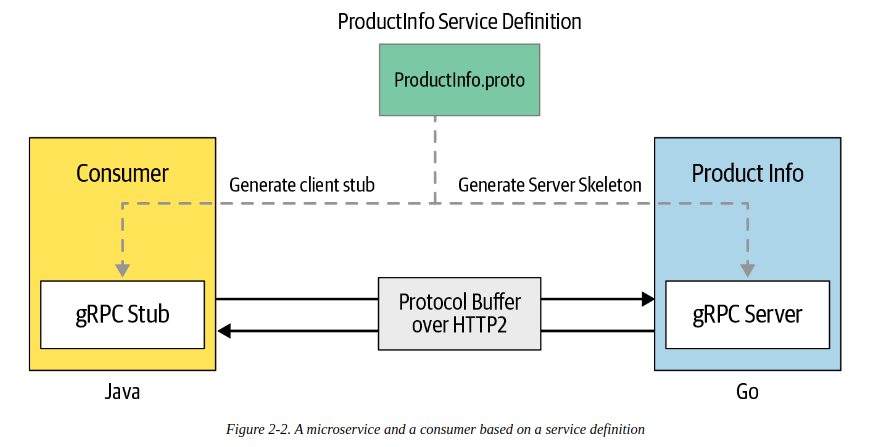

# gRPC explained

## gRPC vs other protocol
- Apache thrift: is a RPC framework, support for HTTP/2, bidirectional streaming
- GraphQL: quite popular for building inter-process communication.
    - is a query language for API
    - is more suitable for external-facing services or API
    
## Define method
```text
syntax = "proto3";
import "google/protobuf/wrappers.proto";

rpc addProduct(Product) returns (google.protobuf.StringValue)
rpc getProduct(google.protobuf.StringValue) returns (Product)
```


## Implementing grpc server
- Step 1: go get -u google.golang.org/grpc
- Step 1.1: define proto file
- Step 2: Implementing business logic
```text
package main
import (
    pb "productinfo/service/ecommerce"
)

type server struct {
    productMap map[string]*pb.Product
}

func (s *server) AddProduct (ctx context.Context, in *pb.Product) (*pb.ProductID, error) {
    out, err := uuid.NewV4()
    if err != nil {
        return nil, err
    }

    in.Id = out.String()
    if s.productMap == nil {
        s.productMap = make(map[string]*pb.Product)
    }
    s.productMap[in.Id] = in
    return &pb.ProductID{ Value: in.Id }, nil
}

func (s *server) GetProduct (ctx context.Context, in *pb.ProductID) (*pb.Product, error) {
    value, exists := productMap[in.Value]
    if exists {
        return value, nil
    }
    return nil, errors.New("Not found")
}
```
- Step 3: listen 
```text
func main() {
    l, err := net.Listen("tcp", port)
    if err != nil {
        log.Fatalf("Fail to listen")
    }
    s := grpc.NewServer()
    pb.RegisterProductInfoServer(s, &server{})
    if err := s.Serve(l); err != nil {
        log.Fatalf("Fail to serve: %v", err)
    }
}
```
- Build: go build -i -v -o bin/server

## Implementing gRPC client
```text
package main

import (
    pb "productinfo/client/ecommerce"
    "google.golang.org/grpc"
)

const (
    address = "localhost:50051"
)

func main() {
    conn, err := grpc.Dial(address, grpc.WithInsecure) 
    if err != nil {
        log.Fatalf("Error connection")
    }
    defer conn.Close()
    c := pb.NewProductInfoClient(conn)
    name := "iPhone"
    description: "This is a iPhone 11"
    price := float32(1000.0)
    ctx, cancel := context.WithTimeout(context.Background(), time.Second)
    defer cancel()
    
    // add product
    r, err := c.AddProduct(ctx, pb.Product{
        Name: name,
        Description: description,
        Price: price,
    })
    if err != nil {
        log.Fatalf("Error add product")
    } else {
        log.Printf("Product ID: %s", r.Value)
    }
    
    // get product
    product, err := c.GetProduct(ctx, &pb.ProductID{ Value: r.Value })
    if err != nil {
        log.Fatal("Error get product")
    } else {
        log.Printf("Product: %v", product)
    }
}
```
- Build: go build -i -v -o bin/client

