# Dive into gRPC
- the gRPC core supports three transport implementation: 
    - HTTP/2
    - Cronet
    - In-process
- gRPC communication flow 
- what encoding techniques (marshal, unmarshal)
- how gRPC uses the underlying network communication techniques 
- how we use protocol buffers as the encoding technique and HTTP/2 as the communication protocol for gRPC

## RPC flow
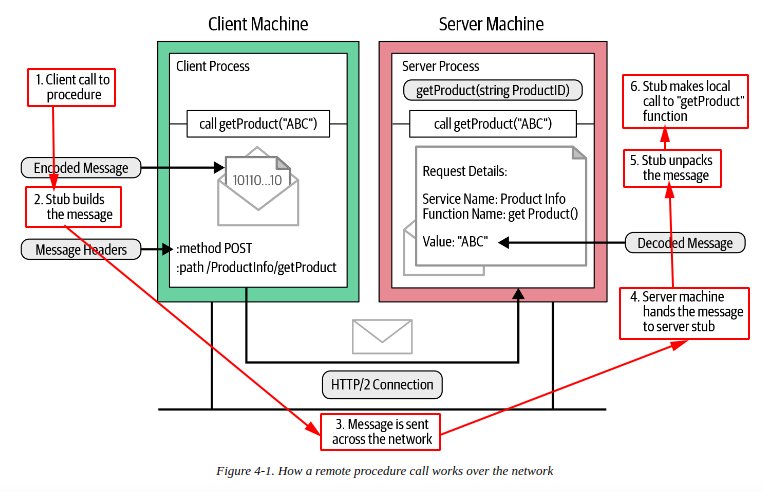

## Message encoding using protocol buffers
- gRPC uses protocol buffers to write the service definition for gRPC services 
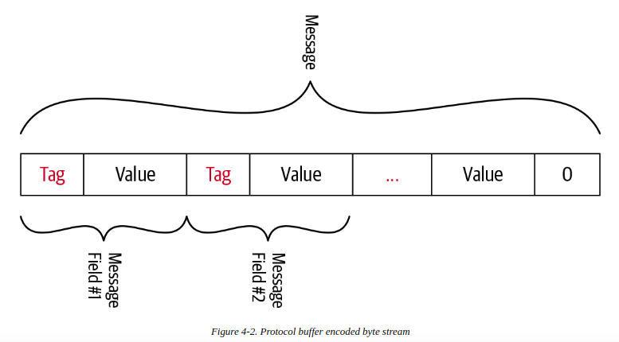
- This tag builds up two values:
    - the field index: unique number we assigned to each message field in proto file 
    - the wire type: based on the field type 
    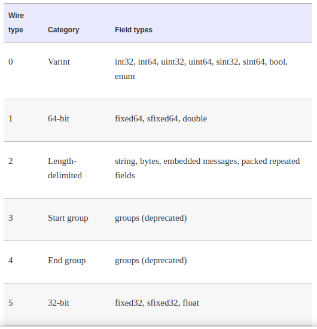
    
## Varints (variable length integers)
- are a method of serializing integers using one or more bytes 

## Signed integers 
- are types that represent both positive and negative integer values
- For example: sint32, sint64
- Zigzag encoding is used to convert signed integers to unsigned integers 

## Nonvariant number
- Nonvarint type allocate a fixed number of bytes 
- Protocol buffers us 2 wire type

## String type
- In protocol buffers, the string type belongs to the length-delimited wire type 
- which means that the value is a varint-encoded length followed by the specified number of bytes of data
- String values are encoded using UTF-8 character encoding 

## Length-Prefixed message framing 
- Message-framing approach constructs information and communication 
- In order to package the message to send over the network, gRPC use a message-framing called length-prefix framing 
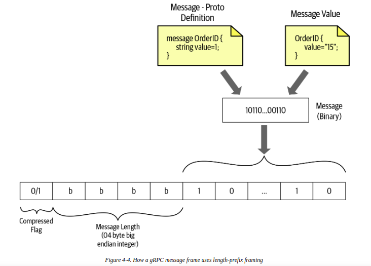

## gRPC over HTTP/2
- gRPC use HTTP/2 as its transport protocol to send messages over the network -> high performance
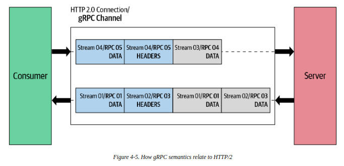

### Request message
- always is triggered by the client application 
- consist of 3 components: request headers, the length-fixed message and the end of stream flag 
- Request message => Request headers | Length-Prefixed-Message | End of stream flag
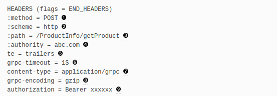
    - 1 define HTTP method
    - 2 define HTTP scheme (http | https)
    - 3 define endpoint path
    - 6 define timeout. If not specified, infinite timeout
    - 7 define content type (application/grpc). If not, responds HTTP 415(unsupported media type)
    - 8 define the message compression type (identity | gzip | deflate | snappy | {custom})
    - 9 this is optional metadata. (authorization metadata is used to access the secure endpoint)
    
### Response message
- is generated by the server 
- consist of 3 components: response headers, length-prefixed messages and trailers
- when there is no length-prefixed message to send as a response to the client -> only have: headers and trailers
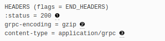
    - 1 status HTTP
    - 2 define the message compression type
    - 3 define the content-type 
- Trailers are sent to notify the client that we finished sending the response message 
- Trailers also carry the status code and status message of the request 
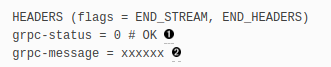
    - 1 define the gRPC status code
    - 2 define the description of the error 
    - HTTP-Status       ->  status
    - Content-Type      ->  content-type
    - Status            ->  grpc-status
    - Status-Message    ->  grpc-message
    
## Simple RPC
- a single request and single response 
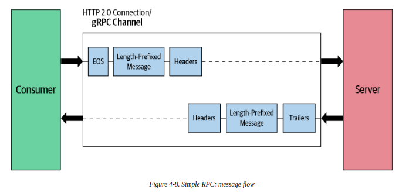

## Server-streaming RPC
- a single request and multiple responses 
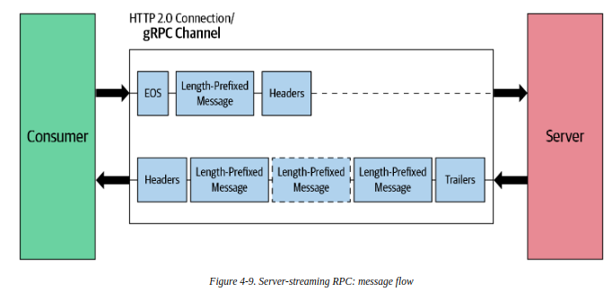

## Client-streaming RPC
- multiple request and a single response
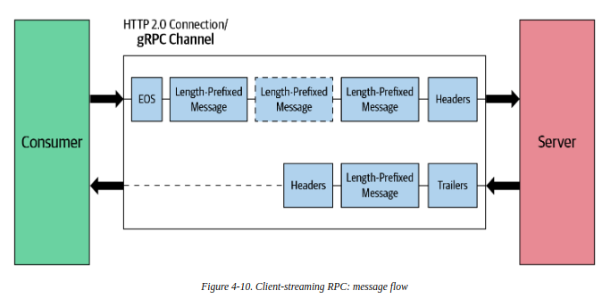

## Bidirectional-streaming RPC
- the client sets up the connection by sending header frames
- both (client and server) send length-prefixed messages without waiting for other to finish
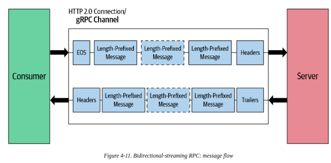 

## gRPC implementation architecture 
- multiple layers:
    - The base layer is the gRPC core layers, which abstracts all the network operations from the upper layers (application layers)
    - The core layer provides extensions to the core functionality 
    - Extension points are authentication filters to handle call security and a deadline filter to implement call deadlines, ...
    - Application layer handles the application logic and data encoding logic (use protocol buffers for encoding data)
    - Dev write app logic by invoking the methods of generated source code 
    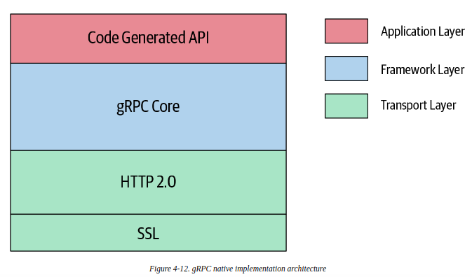
    
## gRPC capabilities 
- intercepting incoming and outgoing RPC 
- handling network delays resiliently 
- handling errors
- sharing metadata between services and consumers  

## Interceptors
- want to execute some common logic before or after the execution of the remote function 
- such as: logging, authentication, metrics, ... using an extension mechanism called an interceptor
#### Server-side interceptors
- execute a common logic prior to the execution of the remote methods 
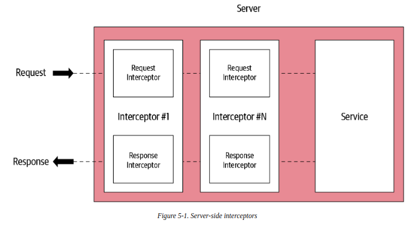

### Unary interceptors
- using in unary gRPC server
```text
// server/main.go
func orderUnaryServerInterceptor(ctx context.Context, 
                    req interface{},
                    info *grpc.UnaryServerInfo,
                    handler grpc.UnaryHandler) {
    // preprocess logic
    log.Println("Server interceptor: ", info.FullMethod)
    
    // invoking the handler to complete the normal execution of a unary RPC
    m, err := handler(ctx, req)
    
    // post processing logic
    log.Println("Post proc message: ", m)
    return m, err
}

// main.go

func main() {
    // registering the interceptor at the server-side
    s := grpc.NewServer(grpc.UnaryInterceptor(orderUnaryServerInterceptor))
}
```
### Stream interceptor
```text
// server/main.go
type wrappedStream struct {
    grpc.ServerStream
}

func (w *wrappedStream)SendMsg(m interface{}) error {
    return w.ServerStream.SendMsg(m)
}

func (w *wrappedStream)newWrappedStream(s grpc.ServerStream) grpc.ServerStream {
    return &wrappedStream{s}
}

func orderServerStreamInterceptor(svc interface{}, 
                    ss grpc.ServerStream,
                    info *grpc.StreamServerInfo,
                    handler grpc.StreamHandler) error {
    ...
    err := handler(svc, newWrappedStream(ss))
    ...                    
}

// main.go
func main() {
    // registering the interceptor
    s := grpc.NewServer(grpc.StreamInterceptor(orderServerStreamInterceptor))
}
```