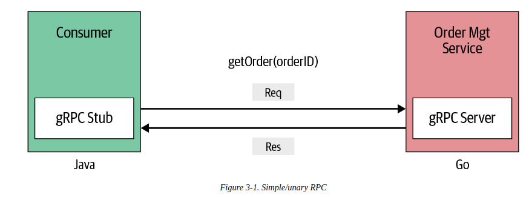
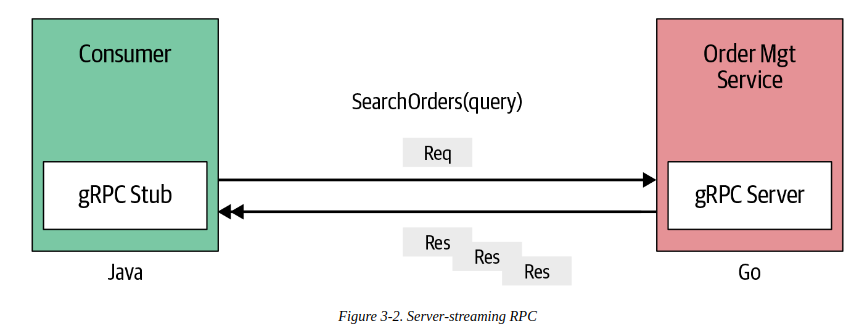
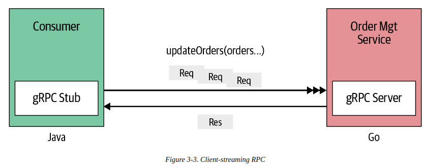

# gRPC Communication pattern
- communicate between client and server with simple request/ response style (unary RPC)
- inter-process communication: sever-side streaming, client-side streaming and bidirectional streaming 

## Simple RPC (Unary RPC)

- Define order.proto
```text
syntax = "proto3";
import "google/protobuf/wrappers.proto";

package ecommerce;

service OrderManagement {
    rpc getOrder(google.protobuf.StringValue) returns (*pb.Order, error);
}

message Order {
    string id = 1;
    repeated string items = 2;
    string description = 3;
    float price = 4;
    string destination = 5;
}
```
- server/main.go
```text
func (s *server) GetOrder (ctx context.Context, orderId *wrapper.StringValue) (*pb.Order, error) {
    ord, exists := orderMap[orderId.Value]
    if exists {
        return &ord, nil
    }
    return nil, errors.New("Not found")
}
```
- client/main.go
```text
orderMgtClient := pb.NewOrderManagementClient(conn)

order, err := orderMgtClient.GetOrder(ctx, &wrapper.StringValue{ Value: "123" })
```

## Server streaming RPC with Send(&order) method
- server sends back a sequence of responses after getting the client's request message
- this sequence of multiple responses is known as stream 
- end stream by sending the server's status details 
- For example: order search 

- server/order.proto
```text
service OrderManagement {
    rpc searchOrders(google.protobuf.StringValue) returns (stream Order);
}

message Order {
    string id = 1;
    repeated string items = 2;
    string description = 3;
    float price = 4;
    string destination = 5;
}
```  
- server/main.go
```text
func (s *server) SearchOrders(searchQuery *wrappers.StringValue), stream pb.OrderManagement_SearchOrdersServer) error {
    for key, order := range orderMap {
        log.Print(key, order)
        for _, itemStr := range order.Items {
            log.Print(itemStr)
            if strings.Contains(itemStr, searchQuery.Value) {
                err := stream.Send(&order)
                if err != nil {
                    return fmt.Errorf("Error sending message to stream")
                }
    
                break;
            }
        }
    }
    return nil
}
```
- client/main.go
```text
c := pb.NewOrderManagementClient(conn)

searchStream, _ := c.SearchOrders(ctx, &wrappers.StringValue{ Value: "Google" })

for {
    searchOrder, err := searchStream.Recv()
    // end stream
    if err == io.EOF {
        break
    }
    log.Print("Search result: %v", searchResult)
}
```

## Client streaming RPC with Recv() method
- the client send multiple messages to the server
- the server send back a single response to the client 
- For example: updateOrders in the OrderManagement service, send the order list as stream 

- server/order.proto
```text
syntax = "proto3";
import "google/protobuf/wrappers.proto"

service OrderManagement {
    rpc updateOrders(stream Order) returns (google.protobuf.StringValue);
}

message Order {
    string id = 1;
    repeated string items = 2
    string description = 3;
    float price = 4;
    string destination 5;
}
```
- client/main.go
```text
func (s *server) UpdateOrders (stream pb.OrderManagement_UpdateOrders) error {
    orderStr := "Update order IDs: "
    for {
        order, err := stream.Recv()
        if err == io.EOF {
            return stream.SendAndClose(
                &wrapper.StringValue{ Value: "Orders processed" + orderStr}
            )
        }
        
        orderMap[order.Id] = *order
        log.Printf("Order ID", order.Id, ": Update")
        ordersStr += order.Id + ", "
    }
}
```
- main.go
```text
c := pb.NewOrderManagementClient(conn)

updateStream, err := c.UpdateOrders(ctx)
if err != nil {
    log.Fatalf("Error update stream: %v", err)
}

// update order 1
if err := updateStream.Send(&updateOrder1); err != nil {
    log.Fatalf("Error update order 1: %v", err)
}

// update order 2
if err := updateStream.Send(&updateOrder2); err != nil {
    log.Fatalf("Error update order 2: %v", err)
}

// end update 
updateRes, err := updateStream.CloseAndRecv()
if err != nil {
    log.Fatalf("Error close stream: %v", err)
}
```